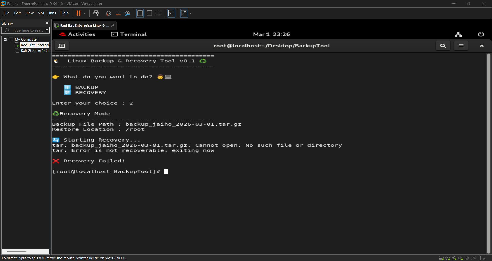
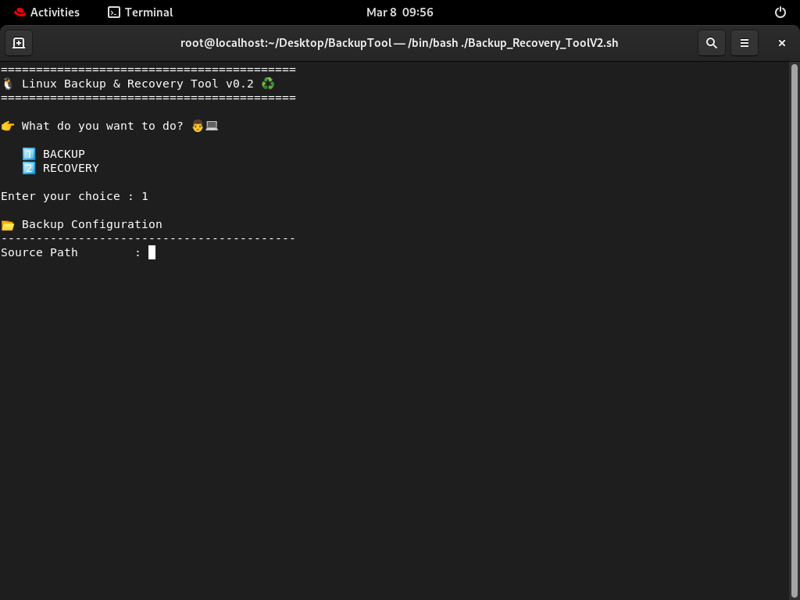
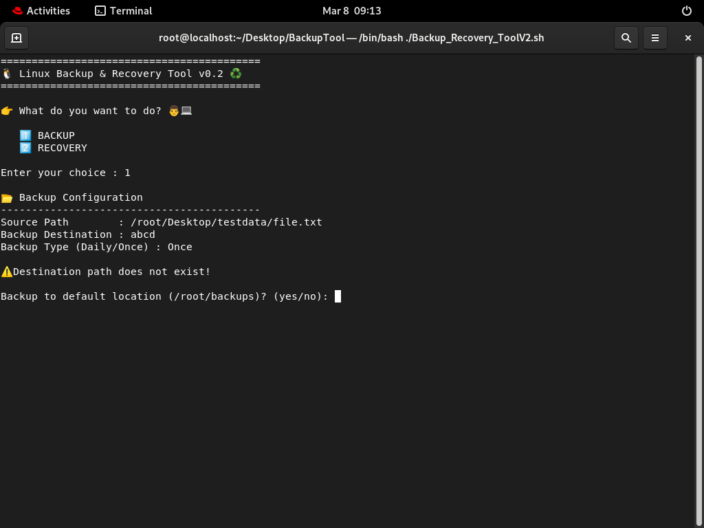
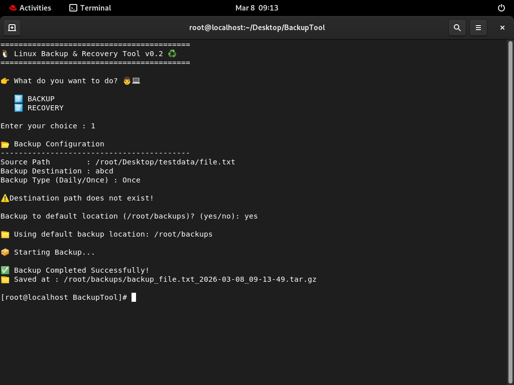

# 🐧 Linux Backup & Recovery Tool

A Bash-based Linux Backup & Recovery Automation Tool designed for system administrators and DevOps beginners to automate backup and restore operations using shell scripting and cron scheduling.

---

## 🚀 Project Overview

This tool allows users to:

✅ Take backup of files or directories  
✅ Restore backups easily  
✅ Automate daily backups using Cron Jobs  
✅ Maintain system recovery readiness  
✅ Practice real-world Linux Administration tasks  

This project is created as part of hands-on Linux & DevOps skill development.

---

## ⚙️ Features
 
- 📂 Directory & File Backup
- ♻️ Recovery Mode
- ⏰ Cron-based Automated Backup
- ✅ Input Validation
- 🖥️ Interactive CLI Interface
- 🐧 Works on Linux Systems

---

## 🛠️ Technologies Used

- Bash Shell Scripting
- Linux Administration
- Cron Scheduler
- TAR Compression Utility

---

## 📦 Project Structure
```
linux-backup-recovery-tool/
│
├── scripts/
│   └── backup_tool.sh
│
├── screenshots/
│
├── README.md
├── LICENSE
├── .gitignore
│
└── Releases (v0.1)
```


---

## ▶️ How to Use

### 1️⃣ Give Execute Permission
```bash
chmod +x backup_tool.sh
```
### 2️⃣ Run Tool
```
./scripts/backup_tool.sh
```
📸 Sample Output
### Main Interface


### Backup Execution


### Recovery Execution


### Error Handling

---

🔄 Version

v0.1 – Initial Backup & Recovery Tool Release

---


🎯 Future Improvements

Automatic directory creation

Backup verification system

Logging mechanism

Email notification support

Incremental backups

---
## 📌 Use Case

This tool simulates real-world Linux system administration tasks such as automated backups and disaster recovery used in production environments.

---
## 🚀 Version v0.2 Updates

- Added logging system
- Improved validation for source and destination paths
- Automatic fallback backup location
- Timestamp-based backup naming
- Support for backing up both files and directories

 ## Screenshots

### Tool Interface


### Invalid Destination/Path Alert


### Default Backup Location



---

👨‍💻 Author

Siddharth Bhatt

Linux | DevOps Enthusiast

---

⭐ If you like this project, consider giving it a star!
